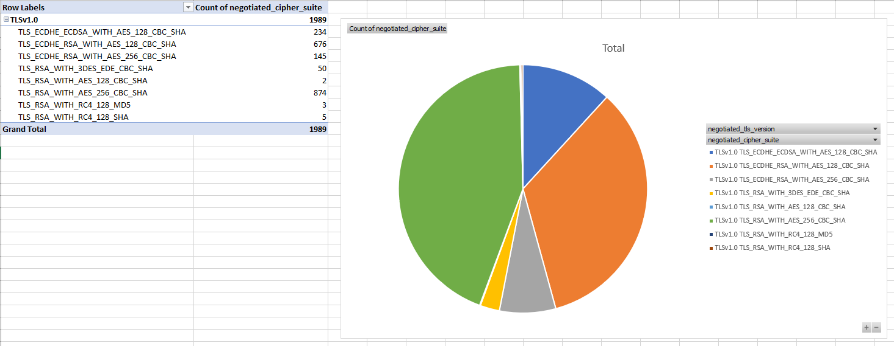

# WhaTLS

What version of TLS and ciphers is your service using? WhaTLS reports on all SSL 
sessions that were captured and exports the data to CSV.

From the data, making a pivot table and chart is basic Excel magic.

## What is included in the report?

* capture_file - The name of the capture file where the data was pulled.
* tcp_stream_id - The TCP stream ID in the capture. Useful for finding the packets in the capture for additional research.
* client_hello - The full packet details of the Client Hello packet in the TLS handshake for a given session.
* server_hello - The full packet details of the Server Hello packet in the TLS handshake for a given session.
* negotiated_tls_version - What version of SSL/TLS was chosen for a given session.
* negotiated_cipher_suite - What cipher suite was chosen for a given session.

## Installation

1. Python 3.6 at a minimum.
1. `git clone https://github.com/clay584/whatls && cd whatls`
2. `pip install -r requirements.txt`

## Usage

1. Take a packet capture from a device and save to file.
2. Pre-filter your capture with `tcpdump -nt -r MyCaptureFile.pcap "$(cat ssl_filter.bpf)" -w MyCaptureFile_filtered.pcap`. This 
does two things. First, it makes the analysis faster by orders of magnitude as `tcpdump` with `bpf` is way faster than using a 
display filter and iterating through packets with pyshark. Second, I've noticed that when a capture is taken and analyzed 
without first running it through `tcpdump`, pyshark chokes on it for some reason and gives incomplete data. In test captures, 
41 SSL sessions were found, whereas after using `tcpdump` to filter, pyshark was able to analyze all of it, resulting in 
151 SSL sessions.
3. Run `./whatls.py MyCaptureFile_filtered.pcap`.
4. The CSV report will be saved to `MyCaptureFile_filtered.csv`.

## Credits

* Thanks to Brian [@infosecsamurai](https://twitter.com/infosecsamurai) for optimizations and testing.